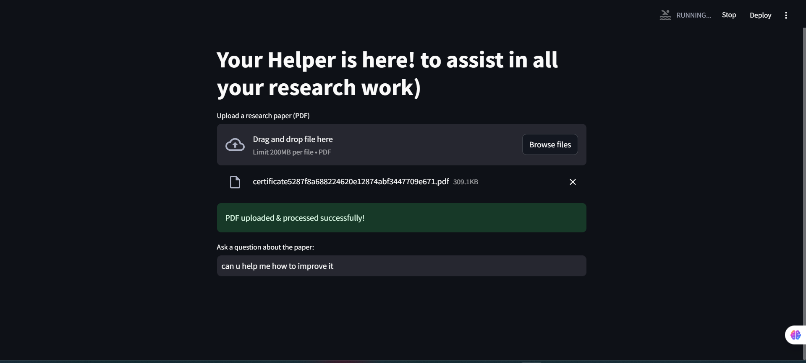
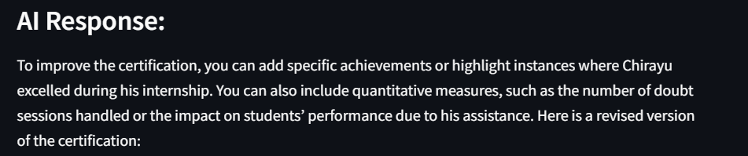
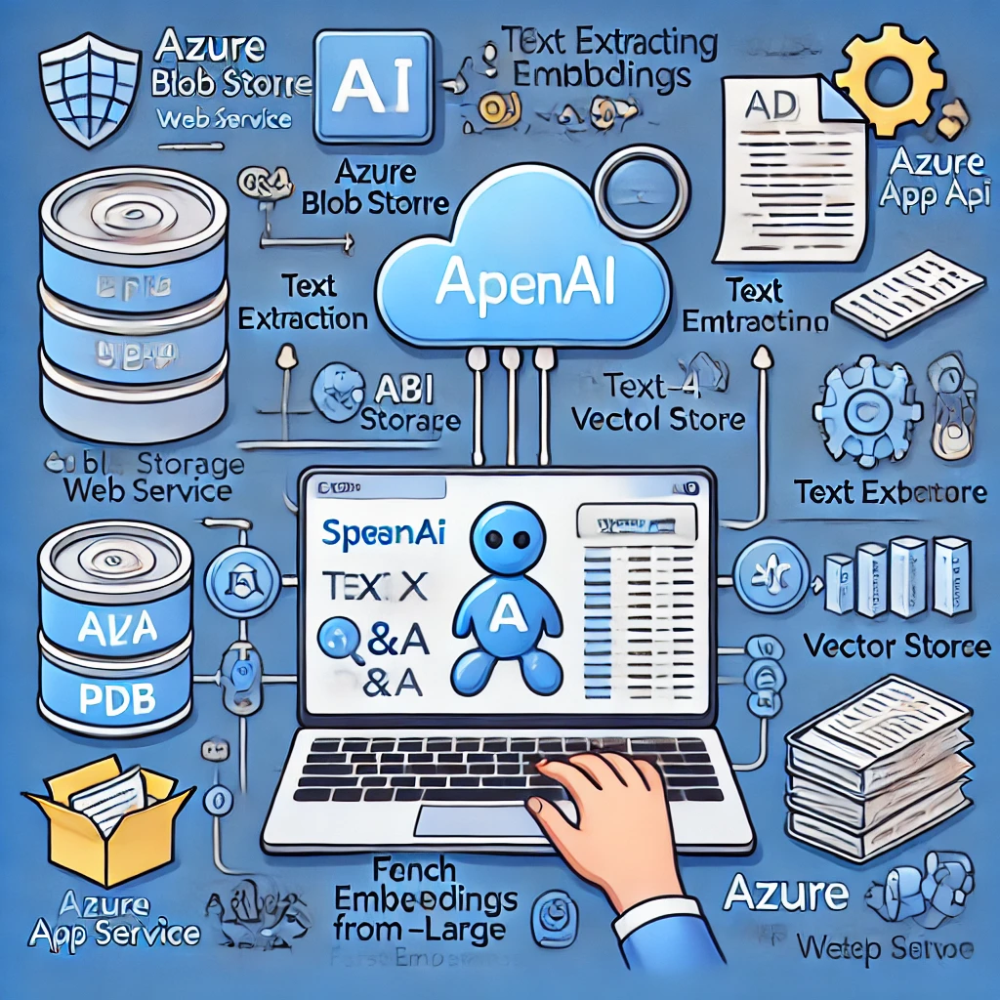

# 📚 LLM Based Research Assistant By Using Azure Open Ai 

> **AI-driven research assistant that extracts insights from research papers using Azure OpenAI & FAISS.** 🚀


---

## 🔥 Key Features

✅ **AI-Powered Q&A** – Uses GPT-4 to answer research paper-related queries.  
✅ **Advanced Search with FAISS** – Embeddings-powered similarity search for quick info retrieval.  
✅ **Azure Cloud Integration** – Uses **Azure OpenAI** for LLMs & **Azure Blob Storage** for PDFs.  
✅ **Streamlit Web UI** – User-friendly frontend for seamless interactions.  
✅ **Optimized for Speed** – FAISS provides fast text retrieval even on large documents.  
✅ **Scalable Deployment** – Deployable on **Azure App Service** with GitHub Actions.

---

## 🎯 How It Works

1️⃣ **Upload a Research Paper (PDF)** 📄  
2️⃣ **Text Extraction & Vector Storage** 🧠 (Stored in FAISS for fast retrieval)  
3️⃣ **Ask a Question** ❓ (AI searches relevant content)  
4️⃣ **AI Generates an Answer** 💡 (Using GPT-4 with retrieved context)  

---

## 🖼️ Screenshots

### 🔹 Upload a Research Paper


### 🔹 Ask a Question & Get AI Response


### 🔹 System Architecture


---

## 🚀 Quick Setup

### 1️⃣ **Clone the Repository**
```bash
git clone https://github.com/yourusername/AI-Research-Assistant-Azure.git
cd AI-Research-Assistant-Azure
```

### 2️⃣ **Install Dependencies**
```bash
pip install -r requirements.txt
```

### 3️⃣ **Set Up Environment Variables**
Create a `.env` file and add:
```bash
AZURE_OPENAI_ENDPOINT=your_endpoint_here
AZURE_OPENAI_KEY=your_key_here
AZURE_STORAGE_CONNECTION_STRING=your_storage_connection_here
```

### 4️⃣ **Run the Application Locally**
```bash
streamlit run app.py
```

---

## 🌎 Deploying on Azure

### 1️⃣ **Deploy with Azure CLI**
```bash
az login
az webapp up --name research-assistant --resource-group MyResourceGroup --runtime "PYTHON:3.9"
```

### 2️⃣ **Configure Environment Variables**
Go to Azure Portal → App Service → Configuration → Add Environment Variables.  

### 3️⃣ **Access Your Web App**
Your app will be live at: `https://research-assistant.azurewebsites.net/` 🎉

---

## 🏆 Why This Project Stands Out

🚀 **Uses Cutting-Edge LLM Tech** – GPT-4 + FAISS + Azure OpenAI.  
📊 **Real-World AI Application** – AI-powered research assistant for academics.  
☁️ **Cloud-Integrated** – Showcases end-to-end **Azure deployment skills**.  
🔍 **Optimized for Search** – Vector embeddings for high-speed info retrieval.  

---

## 🤝 Contributing
1️⃣ **Fork** the repository.  
2️⃣ Create a **new branch** (`feature-branch`).  
3️⃣ **Commit** changes & push.  
4️⃣ Open a **Pull Request**.  

---

## 📜 License
This project is licensed under the **MIT License**.

---

## 🌟 Star This Repo!
If you found this project useful, **leave a star ⭐** to support future improvements!
